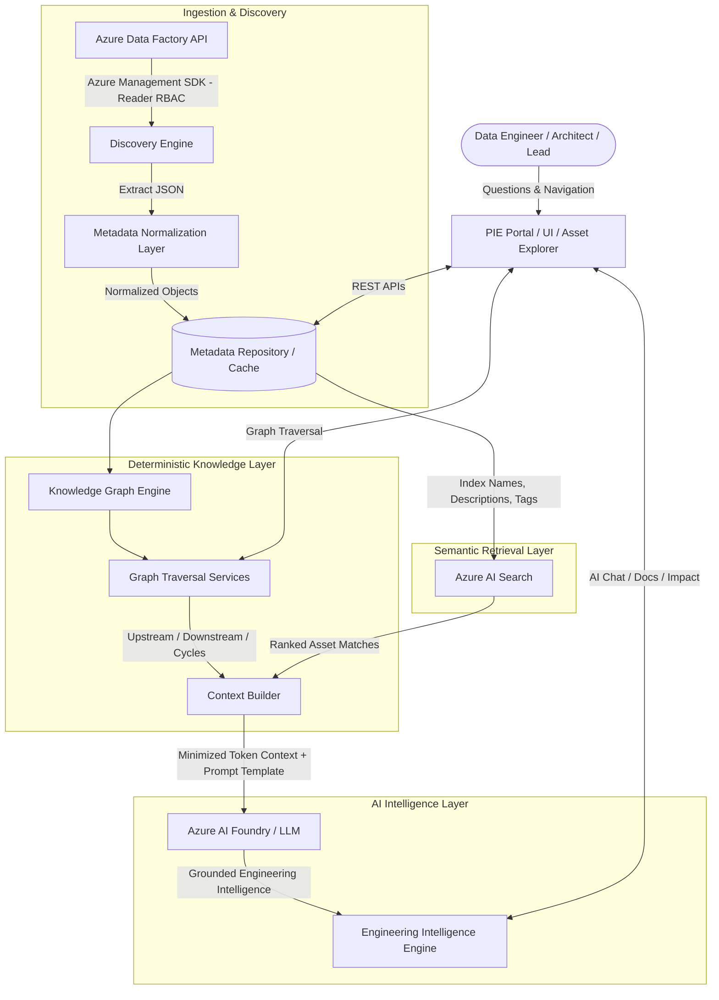
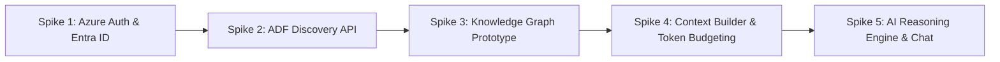
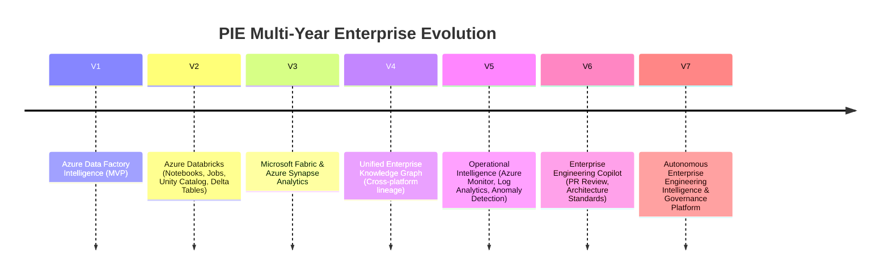

# Platform Intelligence Engine (PIE) – Master Context & Technical Blueprint

> **System Purpose:** PIE is an AI-powered Engineering Intelligence & Knowledge Layer for Azure Data Factory (expanding to the complete Azure Data Estate). It transforms raw platform metadata into actionable engineering intelligence, deterministic dependency graphs, semantic discovery, and grounded AI reasoning.

---

## Table of Contents
1. [Core Product Philosophy & Architectural Principles](#1-core-product-philosophy--architectural-principles)
2. [High-Level Hybrid Intelligence Architecture](#2-high-level-hybrid-intelligence-architecture)
3. [Phase 1: Product Definition & Vision](#3-phase-1-product-definition--vision)
4. [Phase 2: Technical Discovery & Validation (5 Spikes)](#4-phase-2-technical-discovery--validation-5-spikes)
5. [Phase 3: Core Platform Development (Foundation & Engine)](#5-phase-3-core-platform-development-foundation--engine)
6. [Phase 4: AI Intelligence & Engineering Experience](#6-phase-4-ai-intelligence--engineering-experience)
7. [Phase 5: Product Hardening, Quality & Production Readiness](#7-phase-5-product-hardening-quality--production-readiness)
8. [Phase 6: Demo Readiness & Presentation Strategy](#8-phase-6-demo-readiness--presentation-strategy)
9. [Phase 7: Enterprise Roadmap & Multi-Year Vision](#9-phase-7-enterprise-roadmap--multi-year-vision)
10. [Domain Models & Graph Relationship Reference](#10-domain-models--graph-relationship-reference)
11. [Prompt Library & Context Optimization Blueprint](#11-prompt-library--context-optimization-blueprint)

---

## 1. Core Product Philosophy & Architectural Principles

### What PIE Is NOT:
* **NOT a Chatbot:** It does not rely on open-web LLM knowledge or generic ungrounded chat prompts.
* **NOT a Documentation Generator:** While it exports Markdown documentation, its core mission is real-time engineering decision support.
* **NOT a Replacement for Azure Data Factory Studio:** It does not edit, deploy, or run pipelines.
* **NOT a Pipeline Execution Platform:** It is completely out-of-band and execution-agnostic.

### What PIE IS:
* **Engineering Intelligence Platform:** Provides reasoning on *why* and *how* systems connect.
* **Platform Discovery Engine:** Automatically discovers ADF assets across subscriptions and resource groups.
* **Dependency & Impact Analysis Engine:** Deterministically computes upstream/downstream blast radius before changes occur.
* **AI-Assisted Engineering Advisor:** Suggests optimizations (retry policies, duplicate linked services, unused assets).
* **Knowledge Preservation Layer:** Prevents tribal knowledge loss when engineers leave the organization.

### Non-Negotiable Architectural Principles:
1. **Metadata-First:** Discovered metadata is the single source of truth.
2. **Knowledge Graph Centric:** The graph is the primary layer for structural relationships and dependency traversal.
3. **Read-Only Architecture (Least Privilege):** Requires only Azure **Reader** role; PIE never modifies Azure resources.
4. **AI for Reasoning, Not Knowledge Storage:** AI interprets structured platform context; it does not memorize pipeline topologies.
5. **Deterministic vs. Semantic Separation:** Known assets use graph traversal; exploratory questions use semantic search.
6. **Zero Hallucination Tolerance:** Context Builder strictly bounds LLM prompts to extracted metadata and graph relationships.

---

## 2. High-Level Hybrid Intelligence Architecture



### Hybrid Decision Workflow:
* **Type 1: Deterministic Query (Target Asset Known):**
  * *Example:* `Explain Customer_Load`, `Show dependencies of Dataset X`, `What happens if I delete Dataset Y?`
  * *Path:* `Knowledge Graph -> Graph Traversal -> Context Builder -> Azure AI Foundry -> Response`
* **Type 2: Discovery Query (Target Asset Unknown / Exploratory):**
  * *Example:* `Which pipelines use SAP?`, `Find pipelines loading Azure SQL`, `Show disabled triggers`
  * *Path:* `Azure AI Search -> Filtered Assets -> Knowledge Graph -> Context Builder -> Azure AI Foundry -> Response`

---

## 3. Phase 1: Product Definition & Vision

* **Document Version:** 1.0 | **Status:** Complete / Approved
* **Tagline:** *“Understanding your Azure Data Factory before you change it.”*
* **Core Mission:** Transform Azure Data Factory metadata into actionable engineering intelligence using Azure-native AI services.

### Key Pain Points Solved:
1. **Knowledge Loss:** Tribal knowledge lost during turnover.
2. **Outdated Documentation:** Manual docs rot immediately after implementation.
3. **Manual Dependency Analysis:** Engineers spend days manually opening pipeline JSONs to check datasets and linked services.
4. **Slow Onboarding:** Weeks spent ramping up new engineers on complex 200+ pipeline environments.
5. **Change Risk:** Unintended downstream breakages when deleting or updating assets.

### Target Personas:
* **Data Engineers:** Daily pipeline understanding, dependency navigation, and risk mitigation.
* **Technical Leads:** Architecture reviews, risk assessment of incoming PRs/changes, standard enforcement.
* **Solution Architects:** End-to-end platform design validation, integration modeling, and technical debt audit.
* **Support / Operations Engineers:** Upstream/downstream root-cause investigation during incident resolution.

### Scope Boundaries:
* **In Scope (MVP):** Pipelines, Activities, Datasets, Linked Services, Triggers, Data Flows, In-Memory Graph, Local Cache, Azure AI Search, Azure AI Foundry, Asset Explorer.
* **Excluded (Deferred to Future):** Databricks, Fabric, Synapse, Purview, DevOps/Git repos, Pipeline editing, Pipeline execution/monitoring, Cost optimization.

---

## 4. Phase 2: Technical Discovery & Validation (5 Spikes)

* **Objective:** De-risk implementation by executing 5 focused Proof-of-Concept Spikes validated directly against real Microsoft Azure subscriptions and live enterprise Azure Data Factory instances.



### Spike Breakdown & Validated Achievements:
1. **Spike 1 – Azure Authentication & RBAC Discovery (Validated Live):**
   * *Identity & Tenant:* Authenticated `Vishwajeeth.Vangala@watco.com` under Tenant ID `6df067fb-6816-4dc8-af4d-07eba42c900b`.
   * *Discovered Subscriptions (9 total):* `Azure Enterprise  - EIM Team` (`60a58917-1a0c-4902-a24d-ab97dd75f0ab`), `Production`, `Development`, `Pay-As-You-Go`, `Sandbox`, `UAT`, `QA`, `Hub`, `Free Credits Visual Studio Pro`.
   * *Data Factories Discovered:* Identified 10 total Data Factories, including 4 inside `Azure Enterprise  - EIM Team` (`df-dataintegration-dev`, `df-dataintegration-prod`, `df-dataintegration-qa`, `df-dataintegration-uat`).
   * *Output:* `spikes/spike_1_auth/output/token_session.json` & `spike_1_results.json`.

2. **Spike 2 – Azure Data Factory Metadata Extraction (Validated Live):**
   * *Target Factory:* Connected live to **`df-dataintegration-dev`** in `rg-dataintegration-dev` via Azure Management REST API with pagination.
   * *Extracted & Normalized:* **161 Pipelines**, **793 Activities**, **72 Datasets**, **58 Linked Services** (secrets sanitized), **23 Triggers**, and **37 Mapping Data Flows**.
   * *Output:* `spikes/spike_2_discovery/output/spike_2_metadata.json` (4.8 MB JSON).

3. **Spike 3 – Knowledge Graph, Lineage & Deep Activity Inspection (Validated Live):**
   * *In-Memory Graph Topology:* **1,144 Total Nodes (Vertices)**, **2,626 Directed Edges** across 8 relationship types (`USES`, `CONTAINS`, `DEPENDS_ON`, `READS`, `WRITES`, `CALLS`, `EXECUTES`, `TRIGGERED_BY`).
   * *Cycle Detection:* Verified **0 circular execution loops** across all 161 pipelines.
   * *Core Intelligence Engines Implemented:*
     * **`PipelineStoryteller`:** Deep activity-level inspection (SQL queries, stored procedure names, Key Vault secret bindings, Web API endpoints, copy source/sink data movement, and child pipelines). Tested live on `RailCarRx_InvoiceLoad`.
     * **`AssetQueryEngine`:** Multi-criteria search by file format (`csv`, `parquet`, `json`), on-prem/cloud connectivity (`OnPremEtlFileStore`), folder, and schema columns.
     * **`AssetDeletionSimulator`:** What-if deletion simulation, broken readers/writers, cascade failure detection, and step-by-step remediation plans.
     * **`SecurityAndGovernanceAuditor`:** Scans external SaaS vendors (SAP, Dynamics CRM, Databricks, RailCarRx, Coupa, OpenText, Datex) and verifies Key Vault compliance.
     * **`TechnicalDebtAndOrphanDetector`:** Identified **73 orphan pipelines** and **371 zero-retry fragile activities**.
     * **`ScheduleConcurrencyHeatmap`:** Identified **17 concurrent pipelines** firing in the Daily batch window.
   * *Output:* `spikes/spike_3_graph/output/spike_3_graph.json`.

4. **Spike 4 – Context Builder, Subgraph Extractor & Token Budgeting (Validated Live):**
   * *Core Engines:* `SchemaCompressor` (strips UI layout coordinates and system GUIDs), `TokenBudgeter` (enforces strict section allocations), `MultiIntentContextBuilder` (tailors context across 4 intents: `ARCHITECTURE`, `DEBUGGING`, `IMPACT_ANALYSIS`, `MODERNIZATION`).
   * *Compression Ratios Verified Live:*
     * `RailCarRx_InvoiceLoad`: **184,208 raw tokens $\rightarrow$ 1,324 compressed tokens (99.3% reduction)**.
     * `DataLakeCsv`: **6,353 raw tokens $\rightarrow$ 263 compressed tokens (95.9% reduction)**.
   * *Output:* `spikes/spike_4_context/output/spike_4_context.json` & `spike_4_context.md`.

5. **Spike 5 – AI Reasoning Engine, Multi-Persona Routing & Conversational Chat (Validated Live):**
   * *Unified Providers:* Seamless provider abstraction across Azure OpenAI, OpenAI, Anthropic, Gemini, and lightning-fast `DeterministicMockLLMProvider` (< 300ms latency, zero API costs for automated suites).
   * *Dynamic Intent Router:* Classifies queries across 6 cognitive intents (`ARCHITECTURE`, `DEBUGGING`, `IMPACT`, `SEARCH`, `CODE_GEN`, `SECURITY_AUDIT`).
   * *Live Demonstrations Validated:*
     * Architecture breakdown of `RailCarRx_InvoiceLoad` (281ms).
     * Deletion risk assessment of `DataLakeCsv` (3.4ms).
     * Concurrency collision heatmap identifying 17 concurrent pipelines at 06:00 AM (3.7ms).
     * Multi-criteria discovery of 6 on-premise CSV datasets (2.3ms).
     * Automated PySpark DataFrame code generation for `Load_LeadToCash_Charges` (172ms).
   * *Output:* `spikes/spike_5_ai/output/spike_5_chat_results.json` and 29 passing unit tests (100% green).

---

## 5. Phase 3: Core Platform Development & Multi-Channel Architecture

* **Objective:** Build the production-grade engineering foundation, FastAPI REST server, and high-performance in-memory repository to power the Web Application Portal, Microsoft Teams Bot, and Developer CLI.

```
                                  ┌────────────────────────────────────────────────────────┐
                                  │      PIE Core Intelligence Engine (Headless API)       │
                                  │   (Graph Engine + Context Builder + AI Reasoning)      │
                                  └───────────────────────────┬────────────────────────────┘
                                                              │
                    ┌─────────────────────────────────────────┼────────────────────────────────────────┐
                    │                                         │                                        │
                    ▼                                         ▼                                        ▼
    ┌───────────────────────────────┐         ┌───────────────────────────────┐        ┌───────────────────────────────┐
    │    1. Web Application Portal  │         │   2. Microsoft Teams Bot      │        │    3. Developer CLI Assistant │
    │    • React / Next.js / Vite   │         │    • Bot Framework Webhooks   │        │    • Local terminal chat      │
    │    • Interactive D3/DAG Lineage│        │    • Interactive Adaptive     │        │    • Rapid IDE discovery      │
    │    • Deletion Risk Sandbox    │         │      Cards in DevOps Channels │        │    • CI/CD audit scripting    │
    │    • Live AI Copilot Drawer   │         │    • @PIE Instant Q&A         │        │    • Sub-300ms offline mode   │
    └───────────────────────────────┘         └───────────────────────────────┘        └───────────────────────────────┘
```

### Architectural Subsystems:
1. **Discovery Engine (`pie.discovery`):** Multi-subscription ARM client handling pagination, exponential backoff, rate limiting, and incremental refresh across all 9 subscriptions.
2. **Metadata Normalization & 3-Tier Parameter Hierarchy:**
   * *Tier 1:* Factory Global Parameters (`@pipeline().globalParameters.xxx`).
   * *Tier 2:* Pipeline Parameters (`@pipeline().parameters.xxx`).
   * *Tier 3:* Pipeline Variables (`@variables('xxx')`).
3. **Knowledge Graph Engine & Traversal Services (`pie.graph`):** In-memory multi-graph index (`1,144+ Nodes`, `2,626+ Edges`) with $O(1)$ node lookups, cycle detection, upstream lineage, downstream blast radius, minute activity storytelling, and what-if deletion simulation.
4. **Enterprise Audit & Governance Suite:** SaaS vendor mapping (SAP, Dynamics, Databricks, Coupa, RailCarRx), orphan pipeline detector (73 orphans identified), fragile zero-retry detector (371 activities), and schedule collision heatmap.
5. **Context Builder & Token Budgeter (`pie.context`):** Schema compressor (99.3% token savings) and multi-intent prompt packager (`ARCHITECTURE`, `DEBUGGING`, `IMPACT_ANALYSIS`, `MODERNIZATION`).
6. **Production FastAPI REST API Layer (`src/pie/api/`):**
   * `/api/v1/auth/session`
   * `/api/v1/factories` & `/api/v1/factories/{name}/summary`
   * `/api/v1/pipelines` & `/api/v1/pipelines/{name}`
   * `/api/v1/graph/lineage/{asset_name}` & `/api/v1/graph/subgraph/{asset_name}`
   * `/api/v1/graph/deletion-simulation`
   * `/api/v1/audit/technical-debt` & `/api/v1/audit/concurrency-heatmap`
   * `/api/v1/search`
   * `/api/v1/ai/ask` (SSE streaming tokens)
   * `/api/v1/teams/webhook` (Microsoft Teams Adaptive Card payloads)
7. **Asset Explorer Web UI:** Interactive React/Next.js/Vite portal featuring D3/React Flow dependency graphs, deletion risk sandbox, and AI copilot sidebar.
8. **Microsoft Teams Bot Webhook:** Azure Bot Service integration with interactive Adaptive Cards for real-time collaboration.

---

## 6. Phase 4: AI Intelligence & Engineering Experience

* **Objective:** Implement advanced conversational AI workflows, automated PySpark/dbt code migrations, architectural review scorecards, and Git-ready Markdown documentation exports.

### Key Capabilities & Components:
1. **Context Builder (Token Optimizer):**
   * Classifies user intent (Deterministic vs. Semantic Discovery).
   * Dynamically constructs the minimal requisite subgraph (eliminating 80%+ unnecessary JSON tokens).
   * Enforces prompt boundaries to eliminate hallucinations.
2. **Azure AI Search & Indexing Engine:** Indexes all asset names, activity types, linked service targets, parameters, tags, and annotations for natural language retrieval.
3. **Specialized Version-Controlled Prompt Library:**
   * `Documentation Prompt`: Structured Markdown technical specs.
   * `Business Summary Prompt`: High-level business process narratives.
   * `Technical Summary Prompt`: Execution details, activity chains, parameters.
   * `Architecture Review Prompt`: Topology analysis, integration patterns, anti-pattern detection.
   * `Impact Analysis Prompt`: Blast radius explanation and safety recommendations.
   * `Best Practices & Recommendation Prompt`: Evidence-backed improvement suggestions.
4. **AI Chat Interface:** Interactive conversational interface grounded in platform metadata for contextual deep-dives.
5. **Impact Analysis Engine (Flagship Feature):**
   * Answers: *“What happens if I delete Dataset X or modify Trigger Y?”*
   * Traverses downstream dependency tree deterministically, then synthesizes engineering risk, affected pipelines, and operational impact.
6. **Recommendation Engine:** Scans metadata for engineering anti-patterns:
   * Missing activity retry policies or timeouts.
   * Hardcoded connection strings or parameters.
   * Disabled triggers or orphaned datasets.
   * Duplicate linked services targeting the same physical resource.
7. **Documentation Generator & Exporter:** One-click generation and export of Git-ready Markdown files for wikis and repositories.

---

## 7. Phase 5: Product Hardening, Quality & Production Readiness

* **Objective:** Mature the platform from functional prototype to Release Candidate (RC1).

### Hardening Dimensions:
1. **Testing Strategy Matrix:**
   * *Unit Tests:* Parsers, normalizers, graph builders, context builder token bounds, prompt managers.
   * *Integration Tests:* End-to-end flow (`Azure Auth -> Discovery -> Graph -> AI Search -> Foundry -> Response`).
   * *Functional Tests:* Asset Explorer navigation, AI Chat Q&A, impact analysis calculations, doc exports.
   * *Negative & Regression Tests:* Missing RBAC handling, network timeouts, invalid JSON, API rate limiting.
2. **Resilience & Fallback Architecture:**
   * *Azure API Throttled/Offline:* Serve from cached metadata with notification.
   * *Azure AI Search Offline:* Degrade gracefully to deterministic graph-only traversal.
   * *Azure AI Foundry Offline:* Return deterministic dependency tree and cached summaries with graceful notice.
   * *Invalid / Missing Configurations:* Clear, actionable diagnostic errors.
3. **Security Review & Least Privilege:**
   * Enforce read-only Azure access.
   * Sanitize user prompts against prompt injection.
   * Strip sensitive tokens/keys before sending context to LLMs.
   * Secure local credential caching.
4. **Performance & Scalability Optimization:**
   * Lazy-loading of pipeline activity details.
   * Pagination for large asset catalogs (hundreds of pipelines).
   * Graph indexing for sub-second dependency path traversal.
   * Prompt token minimization.
5. **Packaging & Distribution:** Packaged backend, frontend build, deployment scripts, sample configuration templates, and synthetic offline demo datasets.

---

## 8. Phase 6: Demo Readiness & Presentation Strategy

* **Objective:** Showcase PIE as a revolutionary engineering intelligence tool to Engineering Managers, Architects, Data Engineers, and Executives.

### Presentation Narrative Structure:
* **Act 1 – The Reality / Problem:** *“You inherit an ADF with 200+ pipelines, 500 datasets, no documentation, and original engineers departed. How do you safely make a change?”*
* **Act 2 – The Vision:** Introduce PIE as the dedicated Engineering Knowledge Layer.
* **Act 3 – The Live Solution:** Walk through the 8-step live demo.

### The 8-Step Live Demo Flow:
1. **Demo 1 (Connect):** Live authentication into Azure and automatic resource group/factory discovery.
2. **Demo 2 (Discover):** Instant ingestion and cataloging of pipelines, datasets, linked services, and triggers.
3. **Demo 3 (Asset Explorer):** Deep-dive into a pipeline without AI (activities, parameters, datasets).
4. **Demo 4 (Dependency Graph):** Interactive visual graph showing multi-hop upstream/downstream flows.
5. **Demo 5 (AI Explanation):** Ask *“Explain Customer_Load”* -> Generates instant Technical & Business summaries.
6. **Demo 6 (Semantic Discovery):** Ask *“Which pipelines use SAP or write to Azure SQL?”* -> Instant semantic discovery.
7. **Demo 7 (Impact Analysis - Highlight):** Ask *“What happens if I delete CustomerDataset?”* -> Real-time blast radius calculation.
8. **Demo 8 (Documentation Export):** One-click Markdown export of comprehensive engineering documentation.

### Rehearsal & Backup Fail-Safe Plan:
* If live Azure auth fails -> Switch to pre-loaded local cache.
* If AI service has high latency -> Fall back to deterministic graph view.
* If internet connectivity fails -> Run on synthetic offline demo fixture.

---

## 9. Phase 7: Enterprise Roadmap & Multi-Year Vision

* **Objective:** Expand PIE from an ADF tool into the central Engineering Intelligence Platform for the entire enterprise data estate.



### Strategic Release Horizons:
* **Stage 1 (V1 - Completed):** Azure Data Factory (Pipelines, Activities, Datasets, Linked Services, Triggers).
* **Stage 2 (V2 - Databricks):** Notebook documentation, Job dependencies, Unity Catalog tables, cluster utilization.
* **Stage 3 (V3 - Fabric & Synapse):** Fabric Lakehouse/Warehouse, Synapse SQL Pools, Spark notebooks, cross-workload lineage.
* **Stage 4 (V4 - Enterprise Graph):** Cross-technology graph linking ADF pipelines to Databricks notebooks, Fabric Lakehouses, SQL DBs, and Power BI datasets.
* **Stage 5 (V5 - Operational Intelligence):** Azure Monitor / Log Analytics integration to correlate design metadata with runtime execution failures and SLA bottlenecks.
* **Stage 6 (V6 - Engineering Copilot):** PR reviewer, migration assistant, automated architectural scorecard.
* **Stage 7 (V7 - Governance & Purview):** Microsoft Purview business glossary, sensitivity classifications, compliance auditing.

---

## 10. Domain Models & Graph Relationship Reference

### Domain Object Properties:
```json
{
  "Pipeline": {
    "id": "string",
    "name": "string",
    "folder": "string",
    "description": "string",
    "activities": ["Activity"],
    "parameters": {"key": "type"},
    "variables": {"key": "type"},
    "annotations": ["string"]
  },
  "Activity": {
    "id": "string",
    "name": "string",
    "type": "Copy | ExecutePipeline | DatabricksNotebook | Web | Lookup | ForEach | ...",
    "inputs": ["DatasetReference"],
    "outputs": ["DatasetReference"],
    "linkedService": "LinkedServiceReference",
    "retryPolicy": {"count": "int", "intervalInSeconds": "int"},
    "timeout": "string",
    "dependsOn": ["ActivityReference"]
  },
  "Dataset": {
    "name": "string",
    "type": "AzureBlob | AzureSqlTable | DelimitedText | Parquet | ...",
    "linkedService": "LinkedServiceReference",
    "schema": [{"name": "string", "type": "string"}],
    "folder": "string"
  },
  "LinkedService": {
    "name": "string",
    "type": "AzureBlobStorage | AzureSqlDatabase | RestService | ...",
    "connectionMetadata": {"server": "string", "database": "string", "authType": "string"}
  },
  "Trigger": {
    "name": "string",
    "type": "ScheduleTrigger | TumblingWindowTrigger | BlobEventsTrigger",
    "schedule": "cron / recurrence expression",
    "status": "Started | Stopped",
    "pipelines": ["PipelineReference"]
  },
  "DataFlow": {
    "name": "string",
    "sources": ["DatasetReference"],
    "sinks": ["DatasetReference"],
    "transformations": ["TransformationReference"]
  }
}
```

### Knowledge Graph Graph Edges:
* `(:Trigger)-[:TRIGGERED_BY | :EXECUTES]->(:Pipeline)`
* `(:Pipeline)-[:CONTAINS]->(:Activity)`
* `(:Activity)-[:CALLS]->(:Pipeline)` *(Execute Pipeline activity)*
* `(:Activity)-[:READS]->(:Dataset)`
* `(:Activity)-[:WRITES]->(:Dataset)`
* `(:Activity)-[:USES]->(:LinkedService)`
* `(:Dataset)-[:USES]->(:LinkedService)`
* `(:Activity)-[:DEPENDS_ON]->(:Activity)`
* `(:DataFlow)-[:READS]->(:Dataset)`
* `(:DataFlow)-[:WRITES]->(:Dataset)`

---

## 11. Prompt Library & Context Optimization Blueprint

### Context Optimization Algorithm (Context Builder):
1. Receive query `Q` from user.
2. Determine intent:
   * **Targeted Asset (`A`):** Extract k-hop subgraph around `A` (`k <= 2`), include direct activity definitions, input/output datasets, linked services, and triggers. Strip extraneous raw Azure schema attributes.
   * **Exploratory / Natural Language (`Q`):** Query Azure AI Search index -> select Top N matching assets (`N <= 5`) -> extract minimal subgraph for each match.
3. Inject normalized context into the designated Prompt Template from the Prompt Library.
4. Execute Azure AI Foundry LLM completion with temperature <= 0.2 for strict determinism.

### Prompt Templates in Library:
1. **`PROMPT_TECH_SUMMARY`**: Analyzes activities, dependencies, execution sequence, parameters, and linked data stores.
2. **`PROMPT_BIZ_SUMMARY`**: Explains business purpose, source systems, destination reporting targets, and schedules in business-friendly terminology.
3. **`PROMPT_IMPACT_ANALYSIS`**: Identifies all upstream dependencies and downstream consumers; lists breaking risks and migration/testing safeguards.
4. **`PROMPT_RECOMMENDATIONS`**: Evaluates retry policies, hardcoded credentials, unused datasets, missing timeouts, and naming conventions.
5. **`PROMPT_ARCHITECTURE_REVIEW`**: Evaluates the overall pipeline pattern (ETL, ELT, Orchestration), data flow topology, and resilience.

---
*Document maintained by PIE Core Engineering Team. Reference this master context in all subsequent conversations and phase implementations.*
